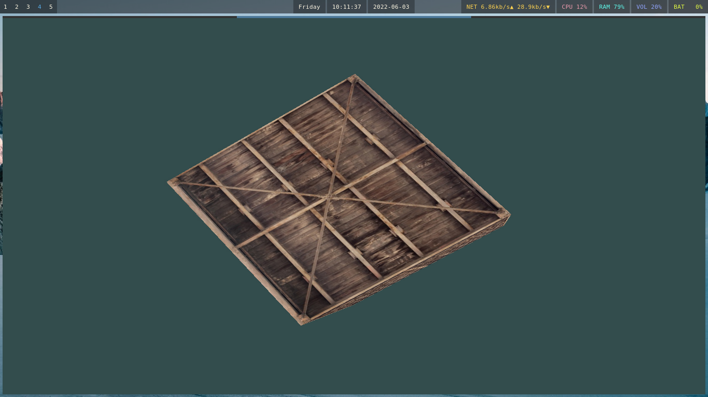
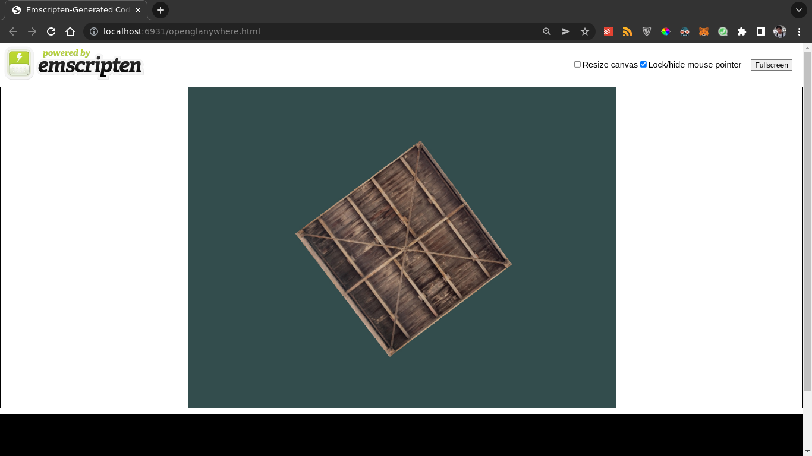
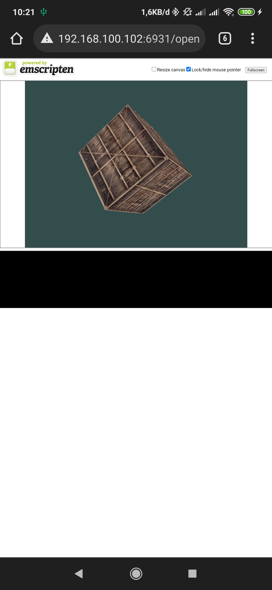

# OpenGL Anywhere

Run OpenGL in C codes in any platforms like linux desktop (wrapped inside gtk widget), android (via native library), & browsers (via emscripten).

This is just my attempt to make code structure for OpenGL C project to run on multiplatform. The code is still rough & less documented but I think it works (at least on my machines). I'm still learning OpenGL, my reference is from this [repo](https://github.com/JoeyDeVries/LearnOpenGL) & [website](https://learnopengl.com/). I'm open to any critics & suggestions about this projects.

Some libraries or additional software that I use:

- [GTK](https://gitlab.gnome.org/GNOME/gtk)
- [GLFW](https://github.com/glfw/glfw)
- [glad](https://github.com/Dav1dde/glad)
- [emscripten](https://github.com/emscripten-core/emscripten)
- [cglm](https://github.com/recp/cglm)
- [stb_image](https://github.com/franko/stb_image)

## Building

For desktop:

```sh
mkdir build && cd build
cmake ..
make
```

For browser:

```sh
mkdir build && cd build
emcmake ..
emmake make
```

For android:

You need to open the `platforms/android` directory with Android Studio, and do the build from there.

## Todo

- [ ] Adjust the code to compile & run on Windows.
- [ ] Adjust the code to compile & run on Mac OS.
- [ ] Adjust the code to compile & run on iOS.

## Some Screenshots





